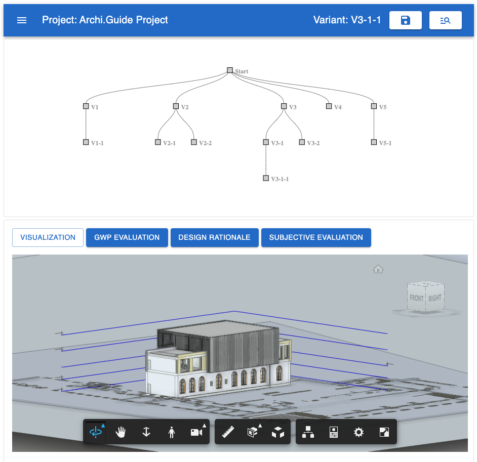

# Decision Support Tool

This is the repository for the Project _Decision Support for Building Processes
with Visualization, Assessment, and
Comparison_ at TUM University, Munich.

  

The system aims at providing the following features: 

- management and visualization of the architectural design process
- decision documentation visualization
- case-based design enabled through semantic textual similarity determination
- qualitative decision evaluation via expert surveys
- quantiative decision evaluation using Life-cycle analysis

In following image the architecture of the system is depicted:

  

## Setup
It can be run locally or using the Gitpod cloud development environment. For the former a machine with 64bit architecture and a working Docker installation is required. A Gitpod deployment is possible, but requires the setup of an other Neo4j Graph Database by the user.

## Deployment
Once a [Autodesk Cloud Application](https://aps.autodesk.com/developer/start-now/signup) has been created, the application can be easily deployed. Gathered credentials have to be passed to ForgeViewers' _token_ property within the [VariantViewer.tsx](frontend/src/components/Variant/VariantViewer.tsx) component.

Furthermore, a VPN connection to the TUM network has to be established before the application can be run. This is required because the decision documentation service is only accesible from within the network.

Then the application can be started locally from the terminal by issuing:

`docker-compose up`

Alternatively, the decision documentation service can be self-hosted and and existing decision documentation imported. This option requires users to setup a dedicated Neo4j Graph Database to support decision documentation. Consequently, all trafic directed at the `DE_NEO4J` entry in the `docker-compose.yml` file has to be re-directed to this new service. The system can then be deployed locally via `docker-compose` or on the Gitpod cloud development environment. For the later option, the port of the new decision documentation service has to be added to the [gitipod.yml](.gitpod.yml) file.

By default, you can access the frontend on http://0000:3000/.